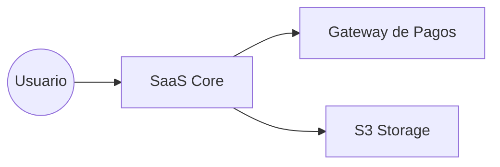

# Diseño de Arquitectura - SaaS Core

## 1. Diagrama de Contexto (Mermaid)

## 2. Decisiones Tecnológicas

###Frontend: 
	React con Vite por su rapidez en desarrollo.
###Backend: 
	Node.js con arquitectura limpia (Clean Architecture).
###Infraestructura:
	Despliegue en contenedores para asegurar consistencia entre entornos de desarrollo y producción.
